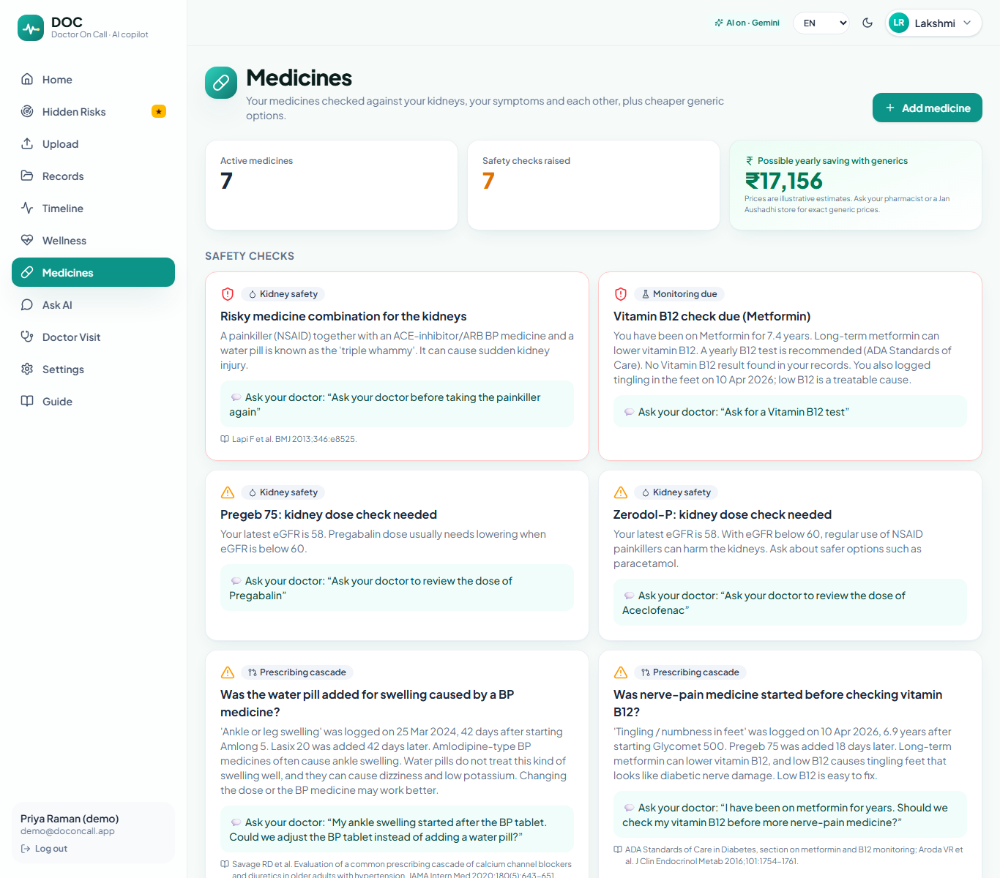
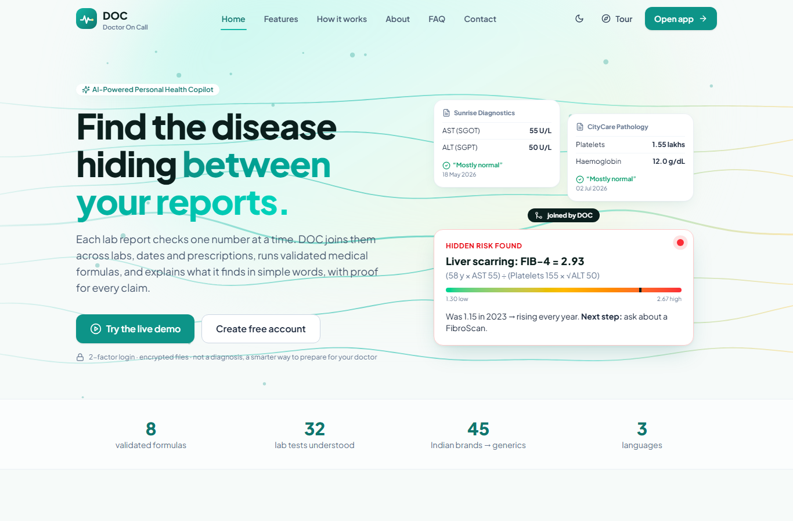
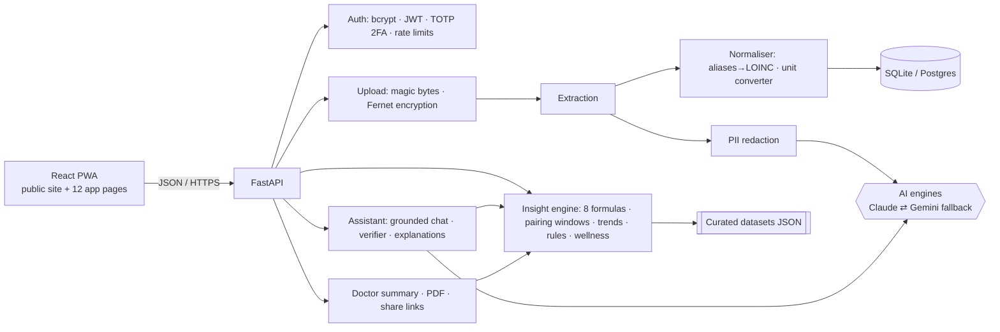

<div align="center">


# DOC: Doctor On Call
### AI-Powered Personal Health Copilot that finds the disease hiding *between* your reports

**DOC reads medical reports, prescriptions and home wellness data, puts every lab on one scale, and joins values across labs, dates and medicines to run 8 published clinical formulas. It then explains what it finds in English, हिन्दी or தமிழ், with a source for every number.**

     

`Altrix Labs Hackathon · Challenge 1 · AI-Powered Personal Health Copilot`

**▶ Try it:** open the app and click **"Try the live demo"**, or go straight to `/demo`. No sign-up needed.

</div>

---

## For judges: how DOC meets each criterion

| Criterion | What DOC does | Evidence |
|---|---|---|
| **Problem fit** | Covers all four inputs named in the brief: **medical records, prescriptions, diagnostic reports and wellness data**. Turns them into understanding, organisation and management. | §2, §5; [User guide](USER_GUIDE.md) |
| **Innovation** | **Hidden Disease Finder**: joins values *across* reports, labs and dates (time-window pairing) to compute 8 validated scores that no single report shows. It also finds prescribing cascades and links wellness data to medicines (e.g. *home BP rose after an NSAID was started*). | `backend/app/services/engine.py`, `wellness.py`; §3 |
| **Technical depth** | FastAPI + React PWA, 2 AI engines with automatic fallback, structured JSON outputs, LOINC normalisation, unit harmonisation across 4 unit systems, a personal-baseline trend model, a rules engine with citations, PDF generation, TOTP 2FA, encryption at rest. | §6, [Architecture](docs/ARCHITECTURE.md) |
| **Responsible AI use** | **AI reads and explains; tested code does all medical maths.** Every chat answer cites record IDs, and a second AI pass fact-checks it. The model abstains when unsure, and the confirm step catches reading errors. | §7, [Safety](docs/SAFETY.md) |
| **Measured quality** | 47/47 tests · 9/9 formulas match hand calculations · offline reader 100% on 782 values · **Gemini vision 37/37 values from synthetic phone photos, 0 hallucinations** | §8, [Evaluation](docs/EVALUATION.md) |
| **Impact** | Earlier detection of liver scarring, silent kidney decline, thalassaemia trait and insulin resistance. Catches risky drug combinations, avoids repeat tests, and suggests generic savings (demo family: ~₹17k/year). | §3, §4 |
| **UX & accessibility** | Simple-language explanations in 3 languages, teach-back quiz, 8-slide onboarding tour, voice input/read-aloud, dark mode, mobile layout, reduced-motion support | Screenshots below |
| **Privacy & security** | TOTP 2FA + backup codes, bcrypt, Fernet-encrypted uploads, PII redaction before AI, CSP and security headers, expiring share links, full audit log, export/delete (DPDP Act 2023 principles) | §9 |
| **Completeness** | Public site (Home/Features/About/FAQ/Contact/Legal), app with 12 pages, family profiles, test kit with answer key, CI, Docker, one-click Render blueprint | §10, §11 |

**One-command verification (no API key needed):**
```bash
cd backend && python scripts/verify.py
```
```
Lint (ruff)                         PASS
Automated tests                     PASS (47 passed)
Report reader (100 synthetic PDFs)  names 100.0% | values 100.0%
Formulas vs hand calculations       9/9
Frontend build present              PASS
ALL CHECKS PASSED
```

## Screenshots

| Hidden Disease Finder ★ | Wellness data × medicines |
|---|---|
|  |  |
| **Dashboard** | **Doctor visit summary** |
|  |  |
| **Medicine safety net** | **Home page** |
|  |  |

<p align="center"> </p>

---

## 1. The problem
Indian families managing chronic illness (diabetes, BP, thyroid, kidney disease) carry **folders of disconnected paper**:
- Each lab report checks **one number at a time**. "Normal" on every page can hide a dangerous **combination**.
- Different labs print the same test differently (`2.5 lakhs/cumm`, `250 ×10³/µL`, `250000 /cumm`), so trends across years are invisible.
- Prescriptions from several doctors are never checked together against the kidneys, against each other, or against home BP and sugar readings.
- A specialist visit lasts about 5 minutes, which is too short for anyone to do this maths.

Existing apps mostly **store** records or **summarise one report at a time**. They don't **reason across** them.

## 2. The solution in one picture
```
 Report A (Sunrise Diagnostics, May)        Report B (CityCare Pathology, July)
   AST 55 U/L   ALT 50 U/L                    Platelets 1.55 lakhs/cumm ✓ "normal"
              \                                  /
               \______ joined by DOC (45 days apart, within the 120-day window) ___/
                                   │
          FIB-4 = (Age 58.3 × AST 55) ÷ (Platelets 155 × √ALT 50) = 2.93  🔴 high
          was 1.15 in 2023 → rising every year → "Ask your doctor about a FibroScan"
          + home BP 148/91 since starting a painkiller → "Could Zerodol-P be raising your BP?"
```

## 3. Core innovation: Hidden Disease Finder
| Formula | Hidden condition | Inputs (often from **different** reports) | Source |
|---|---|---|---|
| **FIB-4** | Liver scarring | Age, AST, ALT (LFT) + platelets (CBC) | Sterling 2006, *Hepatology*; age ≥65 cut-off McPherson 2017 |
| **APRI** | Liver scarring | AST + platelets | Wai 2003, *Hepatology* |
| **eGFR CKD-EPI 2021** + decline slope | Silent kidney damage (rapid decline > 5/yr, KDIGO) | Creatinine, age, sex | Inker 2021, *NEJM* (race-free) |
| **Mentzer index** | Thalassaemia trait vs iron deficiency | MCV, RBC | Mentzer 1973, *Lancet* |
| **TyG index** | Insulin resistance before diabetes | Triglycerides + fasting glucose | Simental-Mendía 2008 |
| **TG/HDL** | Insulin resistance / atherogenic lipids | TG, HDL | McLaughlin 2003, *Ann Intern Med* |
| **Non-HDL cholesterol** | Heart & artery risk | Total cholesterol, HDL | NCEP ATP III; Lipid Association of India |
| **Corrected calcium** | Calcium problem masked by low albumin | Calcium + albumin | Payne 1973, *BMJ* |

**How a score is computed** (`engine.py`, `formulas.py`):
1. Values are normalised to canonical units and LOINC-mapped codes.
2. The engine anchors on one input and pairs the **nearest value of every other input within a validated window** (FIB-4 120 days, TyG 14 days, Mentzer same sample), preferring the same report.
3. Deterministic, unit-tested code computes the score.
4. Published cut-offs map it to 🟢/🟡/🔴.
5. The history is recomputed for every past date, and a least-squares slope gives the trend.
6. Each result carries **full provenance**: lab, date and printed line for every input, plus whether each input individually looked "normal".

**Built on top:**
- a **personal-baseline model**: values still inside the range but drifting, with months-to-limit
- **Next Best Test**: insight unlocked per rupee
- a **medicine safety net**: prescribing cascades, eGFR dose rules, the NSAID "triple whammy", B12 monitoring on metformin, side-effect timing from the symptom diary
- **wellness × medicine links**: BP rise after an NSAID, sugar above target, low-sugar episodes, unplanned weight loss, low SpO₂

## 4. Features
| Area | Features |
|---|---|
| 🔐 Login & security | Email + password (bcrypt), **TOTP 2FA** with QR + 8 one-time backup codes, rate-limited login/OTP, 5-minute 2FA challenge tokens |
| 👨‍👩‍👧 Family | Up to 10 profiles per account (parents, children), conditions, DOB, BMI |
| 📤 Upload & confirm | PDF / photo / camera, magic-byte check, **encrypted at rest**. AI reading with per-value confidence + source line; low-confidence values highlighted; nothing is used until confirmed. Offline parser for text PDFs. |
| 🗂️ Records & trends | All reports & values (LOINC codes, as-printed vs stored), cross-lab trend charts with normal bands and lab-change markers, event timeline |
| 🎯 Hidden Disease Finder ★ | 8 formulas, gauges, plugged-in equations, source chips, trends, "why nobody noticed", next step, citations |
| ❤️ **Wellness data** | Home BP, sugar (fasting/after meal), weight & BMI (Asian cut-offs), heart rate, SpO₂, steps, sleep. Manual entry or **CSV import** (template provided). Guideline targets (ISH 2020, ADA, WHO Asia-Pacific) and links to medicines. |
| 💊 Medicines | 45 Indian brands → 30 generics, yearly generic savings, kidney dose checks, cascades, monitoring due, symptom diary |
| 💬 Ask AI | Grounded chat over the person's own records (labs, medicines, symptoms, wellness, insights). Every fact cites an ID, a verifier pass fact-checks it, it says "I don't know" when unsure. Voice in/out. |
| 🗣️ Explain simply | 6th-grade-level explanations in English/Hindi/Tamil + teach-back quiz |
| 🩺 Doctor visit | One-page summary (risks, alerts, meds, labs, **home readings**, questions to ask). PDF, print, expiring share links (24 h–7 d), WhatsApp share. |
| 🌐 Public site | Home with interactive heartbeat waves and cursor effects, 8-slide onboarding tour, Features, How it works, FAQ, About, Contact (working form), Legal (privacy/terms/medical disclaimer), 404 |
| 📱 Mobile | Responsive with bottom tab bar, installable PWA, camera upload, dark mode |

## 5. Mapping to the challenge brief
| Brief says… | DOC |
|---|---|
| *understand* | Explain-simply in 3 languages, teach-back quiz, grounded chat with sources, "why nobody noticed" |
| *organize* | AI reading + confirm, LOINC normalisation, unit harmonisation, family profiles, timeline |
| *manage* | Next Best Test, care-gap reminders, medicine safety net, wellness targets, doctor summary & sharing |
| *medical records, prescriptions, diagnostic reports* | Upload → structured, confirmed, linked records |
| *wellness data* | Home BP / sugar / weight / HR / SpO₂ / steps / sleep with CSV import and medicine links |
| *actionable insights* | Every alert ends with the exact question to ask the doctor |

## 6. Architecture

Details: [docs/ARCHITECTURE.md](docs/ARCHITECTURE.md)

**Stack:**
- Frontend: React 18 · TypeScript · Vite · Tailwind CSS v4 · Recharts · vite-plugin-pwa · Canvas
- Backend: FastAPI · SQLAlchemy 2 · Pydantic · PyJWT · bcrypt · pyotp · cryptography · pypdf · fpdf2
- AI SDKs: **Google Gen AI SDK (Gemini Flash)** · **Anthropic SDK (Claude Opus 5.5)**
- Tooling: pytest · ruff · GitHub Actions · Docker · Render

## 7. AI design: what the AI does and doesn't do
| Task | Done by | Why |
|---|---|---|
| Reading photos, scans, handwriting | **AI vision** (Gemini or Claude), strict JSON schema | Robust to messy reports; returns confidence + source line per value |
| Test names → LOINC codes, unit conversion | **Deterministic code** + curated catalogue | Must be exact and auditable |
| Formulas, trends, rules, wellness targets | **Deterministic, unit-tested code** | Reproducible; no hallucinated numbers |
| Simple explanations, translation, quiz | **AI** | Language and empathy |
| Q&A | **AI** answers from ID-tagged records only, then **a second AI pass verifies every claim** | Grounding + hallucination control |

**Engines:** `AI_PROVIDER=auto` uses Claude first if its key is set, otherwise Gemini.
- Gemini tries `gemini-3.8-flash → 3.7 → 3.6 → 3.5 → flash-latest` and skips busy or rate-limited models.
- Per-request timeouts and a 50-second budget keep the app responsive.
- Claude has server-side refusal fallback.
- With no key at all, **offline mode** still runs the full engine, the text-PDF parser, template explanations and keyword chat.

## 8. Evaluation (reproducible)
| Check | Result | Command |
|---|---|---|
| Automated tests (formulas, units, parser, PII, 2FA, access control, API, upload→confirm, wellness, **test-kit answer key**) | **47 / 47** | `pytest -q` |
| Formulas vs hand calculations (incl. eGFR vs NKF calculator) | **9 / 9** | `python scripts/evaluate.py` |
| Offline reader, 100 synthetic Indian-style PDFs (782 values, 4 unit systems) | names **100%**, values **100%**, dates **100%** | `python scripts/evaluate.py 100` |
| **AI vision (Gemini) on 6 synthetic phone photos** (rotated, blurred, noisy, 37 values) | recall **100%**, values **100%**, dates 6/6, **hallucinated tests 0** | `python scripts/eval_ai.py 6` |
| Test kit (6 PDFs, 3 labs, 2 prescriptions) vs answer key | FIB-4 2.70 · eGFR 65.4 rapid decline · TyG 9.31 · triple whammy · cascade, **all match** | `pytest -k test_kit` |

Honest limits are in [docs/EVALUATION.md](docs/EVALUATION.md). Synthetic data is cleaner than real scans, which is why the confirm step is mandatory.

## 9. Security, privacy & safety
- **Auth:** bcrypt (cost 12), JWT, TOTP 2FA (RFC 6238) with hashed one-time backup codes, rate limits, and a separate short-lived 2FA challenge token.
- **Data:** uploads and TOTP secrets are encrypted with Fernet. Personal identifiers are regex-redacted before text reaches an AI. Every object has an ownership check (tested). There are CSP, X-Frame-Options, nosniff and no-store headers.
- **User control:** expiring/revocable share links (first name only, views audited), full access log, JSON export, account deletion (DPDP Act 2023 principles).
- **Clinical safety:** decision support only. It never changes medicines, cites a guideline for every rule, shows each formula's limits (e.g. FIB-4 not validated under 35), and gives emergency guidance for critical values.

More: [docs/SAFETY.md](docs/SAFETY.md)

## 10. Run it
```bash
# Windows, one command (installs, builds, opens the browser)
.\start.ps1                 # add -Lan to open it from a phone on the same Wi-Fi
.\share.ps1                 # temporary public link via Cloudflare Tunnel
```
**Manual:**
```bash
cd backend && python -m venv .venv && .venv/Scripts/activate && pip install -r requirements.txt
cp .env.example .env        # add GEMINI_API_KEY and/or ANTHROPIC_API_KEY (optional)
cd ../frontend && npm install && npm run build
cd ../backend && uvicorn app.main:app --port 8000      # open http://127.0.0.1:8000
```

**Deploy:**
- **Docker:** `docker build -t doc . && docker run -p 8000:8000 -e GEMINI_API_KEY=... doc`
- **Render:** New → Blueprint → this repo (uses [render.yaml](render.yaml))

| Env var | Purpose |
|---|---|
| `GEMINI_API_KEY` / `ANTHROPIC_API_KEY` | Turn on AI (either or both) |
| `AI_PROVIDER` | `auto` (default) · `gemini` · `claude` |
| `GEMINI_MODEL` | Comma-separated fallback list |
| `JWT_SECRET`, `DOC_ENCRYPTION_KEY` | Secrets (auto-generated locally) |
| `DATABASE_URL` | SQLAlchemy URL (default SQLite) |

**Demo:** "Try the live demo", the `/demo` link, or `demo@doconcall.app` / `Demo@12345`.

**Test it yourself:** download the test kit in the app (Guide page) and compare with [ANSWER_KEY.md](datasets/test_kit/ANSWER_KEY.md).

## 11. Project structure
```
backend/app/services/  engine.py ★ · formulas.py · wellness.py · extraction.py · normalizer.py · units.py
                       ai.py (Gemini+Claude) · assistant.py · summary.py · pii.py · records.py
backend/app/routers/   auth · profiles · reports · insights · wellness · doctor · assistant · account
backend/data/          lab_tests · formulas · panels · medicines · rules · wellness · symptoms (JSON)
backend/tests/         47 tests          backend/scripts/  verify · evaluate · eval_ai · make_test_kit
frontend/src/pages/    Landing · About · Contact · Legal · Auth · Dashboard · Upload · Review · Records
                       Timeline · Risks · Wellness · Medicines · Chat · Doctor · Settings · Guide
datasets/              demo_family.json · test_kit/ (+ANSWER_KEY) · sample_reports/
docs/                  ARCHITECTURE · EVALUATION · SAFETY · JUDGES_QA · screenshots/
```

## 12. How DOC is different
| Capability | Generic AI chat (upload a PDF) | Record-storage apps | **DOC** |
|---|---|---|---|
| Joins values across reports, labs and years | ✗ | ✗ | **✓ time-window pairing** |
| One scale for every lab's units | ✗ | rarely | **✓ + lab-change markers** |
| Validated formulas computed in code | ✗ (LLM arithmetic) | ✗ | **✓ 8, unit-tested** |
| Source line for every number + fact-checking pass | ✗ | ✗ | **✓** |
| Prescribing cascades, kidney dose checks | ✗ | ✗ | **✓** |
| Wellness readings linked to medicines | ✗ | partial | **✓** |
| Hindi/Tamil, family profiles, Indian brands→generics | partial | partial | **✓** |

## 13. Limitations & roadmap
**Limitations:**
- Cut-offs come from published (often non-Indian) cohorts.
- Real photo accuracy depends on image quality, which is why the confirm step exists.
- Prices are illustrative.
- Not a certified medical device; clinical validation is needed before real-world use (CDSCO SaMD pathway).

**Roadmap:** ABHA/ABDM + FHIR export · Bluetooth BP/glucose meters · WhatsApp reminders · clinician-labelled evaluation set · HOMA-IR & WHO CVD risk.

## 14. Disclaimer
DOC is a **decision-support and education tool**. It **does not diagnose, treat or replace a doctor**. All demo data is synthetic (fictional people and labs). In an emergency call **112 / 108**.

<div align="center"><sub>MIT License · Built for the Altrix Labs Hackathon</sub></div>
