<div align="center">


# DOC: Doctor On Call
### AI-Powered Personal Health Copilot that finds the disease hiding *between* your reports

**DOC reads medical reports, prescriptions and home wellness data with its own OCR and models, puts every lab on one scale, and joins values across labs, dates and medicines to run 8 published clinical formulas. It explains what it finds in English, हिन्दी or தமிழ், with a source for every number. Families can share records only with explicit, revocable consent.**

      

`Altrix Labs Hackathon · Challenge 1 · AI-Powered Personal Health Copilot`

**▶ Live app: https://doc-doctor-on-call.onrender.com** · **one-click demo (no sign-up): https://doc-doctor-on-call.onrender.com/demo**

<sub>Free hosting sleeps when idle, so the first visit may take ~50 seconds to wake up.</sub>

</div>

---

## For judges: how DOC meets each criterion

| Criterion | What DOC does | Evidence |
|---|---|---|
| **Problem fit** | Covers all four inputs in the brief: **medical records, prescriptions, diagnostic reports and wellness data**, and turns them into understanding (plain language, 3 languages), organisation (records, timeline, FHIR) and management (care plan, reminders, medicine safety, family care). | §2, §5; [User guide](USER_GUIDE.md) |
| **Innovation** | **Hidden Disease Finder**: joins values *across* reports, labs and dates to compute 8 validated scores that no single report shows. Also prescribing cascades, wellness × medicine links (*BP rose after a painkiller was started*), and **consent-based family care** (a son can follow his mother's sugar trend only after she approves exactly what he may see). | `engine.py`, `family.py`; §3 |
| **Own models** | Not an API wrapper: **Tesseract OCR (English + Tamil)** + dictionary NER parser, **two XGBoost risk models trained on public datasets** (diabetes AUC 0.83, heart AUC 0.91) with exact **TreeSHAP** explanations, our own **1024-d embedding + pgvector RAG**, colour-analysis **wound model**, rule KBs for medicines and diet, curated Tamil templates. Gemini/Claude are an *optional boost*. | §7, [Evaluation](docs/EVALUATION.md) |
| **Responsible AI** | Flags (normal/low/high/**critical**) computed in code from numbers + ranges, never by an LLM. Medicine interactions from a deterministic KB. Every answer has a disclaimer and citations; **urgent code rules force a "see a doctor now / call 112" banner**. Items under 0.75 confidence go to a review list. Never diagnoses or prescribes. | §7, [Safety](docs/SAFETY.md) |
| **Measured quality** | **94/94 tests** (incl. 4 required consent tests + FHIR R4 validation) · 9/9 formulas match hand calculations · reader 100% on 782 values · Gemini vision 37/37 with 0 hallucinations · risk models 5-fold CV AUC 0.834 / 0.913 | §8 |
| **Interoperability** | **FHIR R4 Bundle** (Patient + ABHA, DocumentReference, DiagnosticReport, Observation with LOINC + UCUM + referenceRange + interpretation, MedicationRequest, Condition, vital signs), validated against R4 models. ABHA link/import (mock). | `fhir.py`, `/api/fhir` |
| **Privacy & security** | **Firebase** Google/email sign-in, backend-only access to **Supabase** (service role, RLS deny-all), files **Fernet-encrypted before upload** to a private bucket, 5-minute signed file URLs, CORS allow-list, rate limits, uniform errors, PHI-free structured logs, full audit log visible to the data owner, export/delete-all (DPDP Act 2023 principles). | §9 |
| **Impact** | Earlier detection of liver scarring, silent kidney decline, thalassaemia trait and insulin resistance; risky drug combinations caught; missed checkups and doses reduced; families coordinate care without sharing passwords. | §3, §4 |
| **UX & accessibility** | Plain language at Class 6–8 level, English/Hindi/Tamil, voice input + read-aloud, Tamil PDF page, SOS button on every screen, nearby hospitals map data, dark mode, installable mobile PWA | Screenshots |
| **Completeness** | 103 API endpoints, 27 app pages, demo family with linked family accounts (all `is_demo`), test kit with answer key, CI, Docker (with Tesseract), Render blueprint, `schema.sql`, [API reference](docs/API.md) | §10, §11 |

**One-command verification (no API key needed):**
```bash
cd backend && python scripts/verify.py
```

## Screenshots

| Hidden Disease Finder ★ | Wellness data × medicines |
|---|---|
| 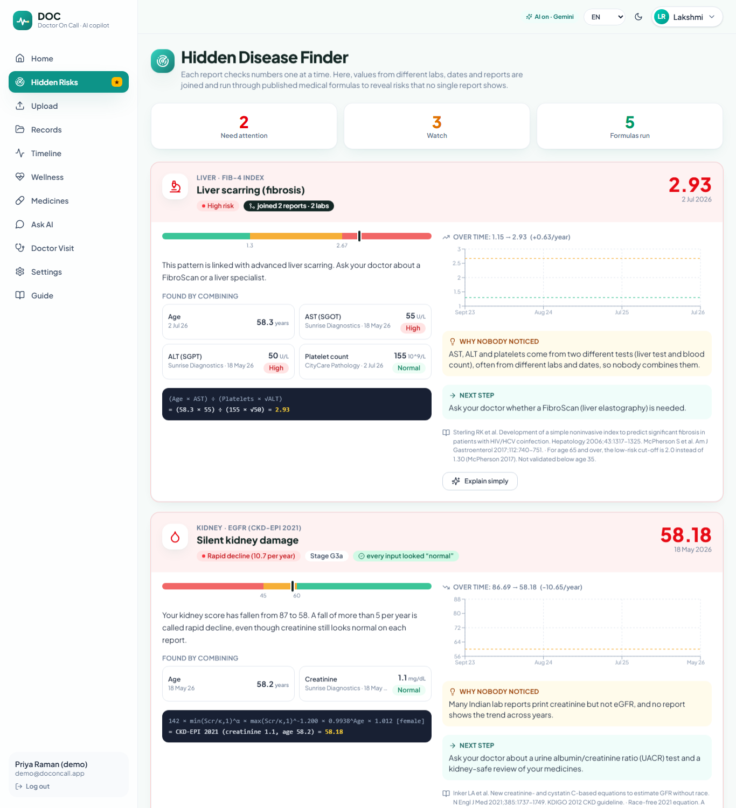 | 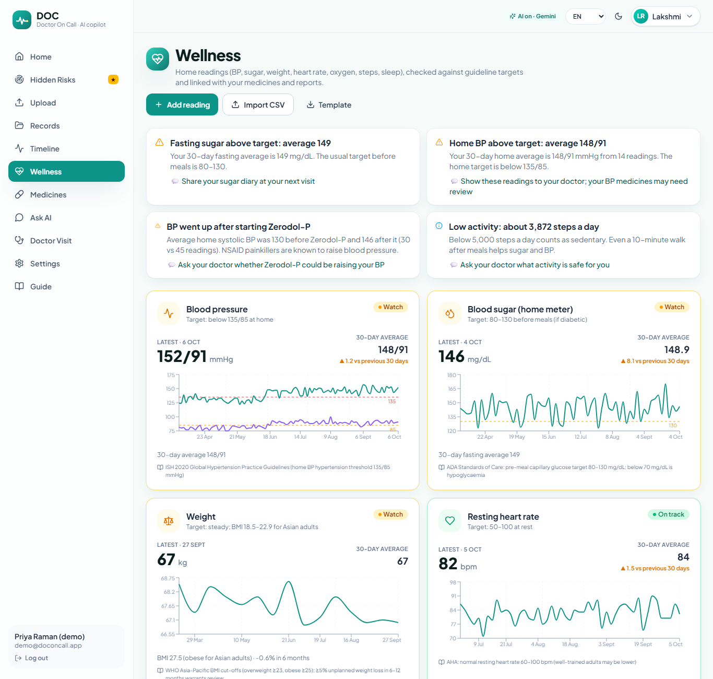 |
| **Dashboard** | **Doctor visit summary** |
| 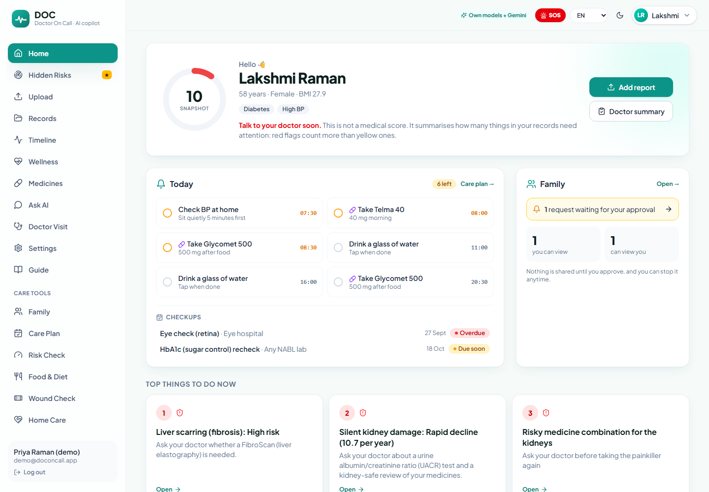 | 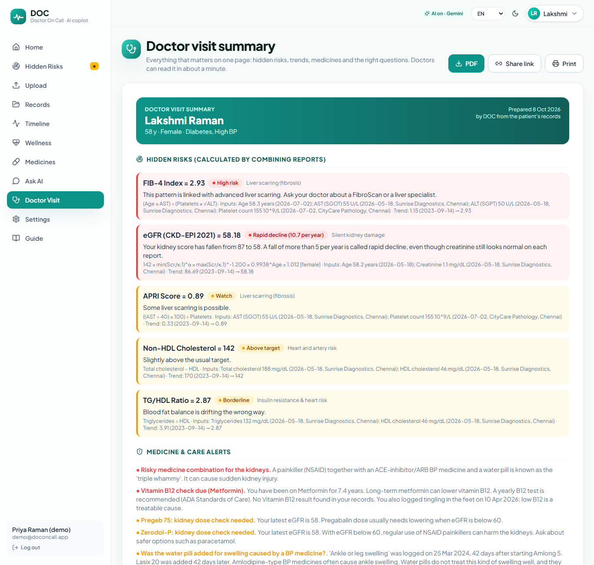 |
| **Family sharing with consent** | **Risk check (XGBoost + SHAP)** |
| 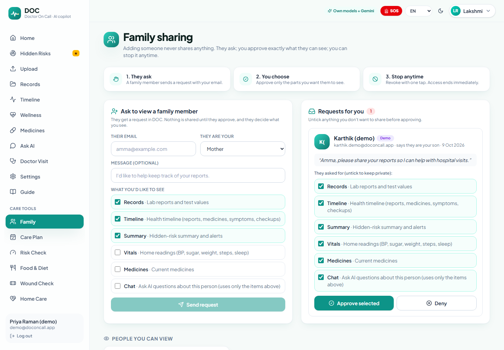 | 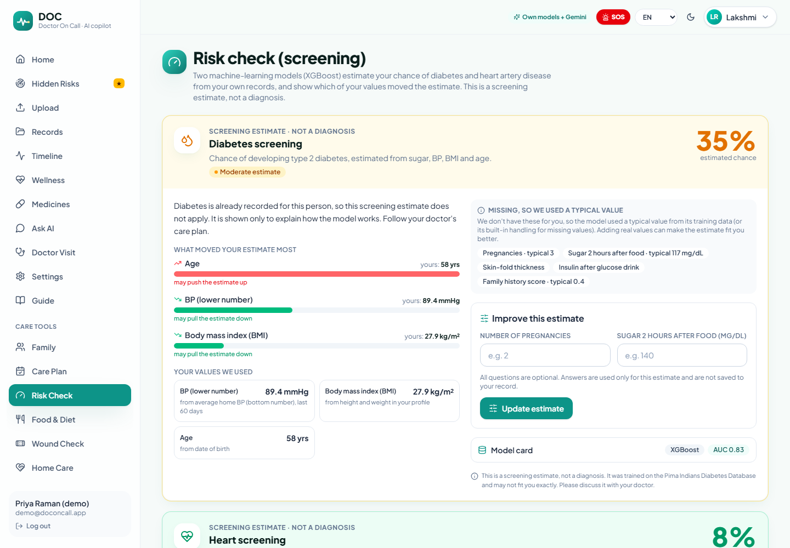 |
| **SOS & nearby hospitals** | **Care plan** |
| 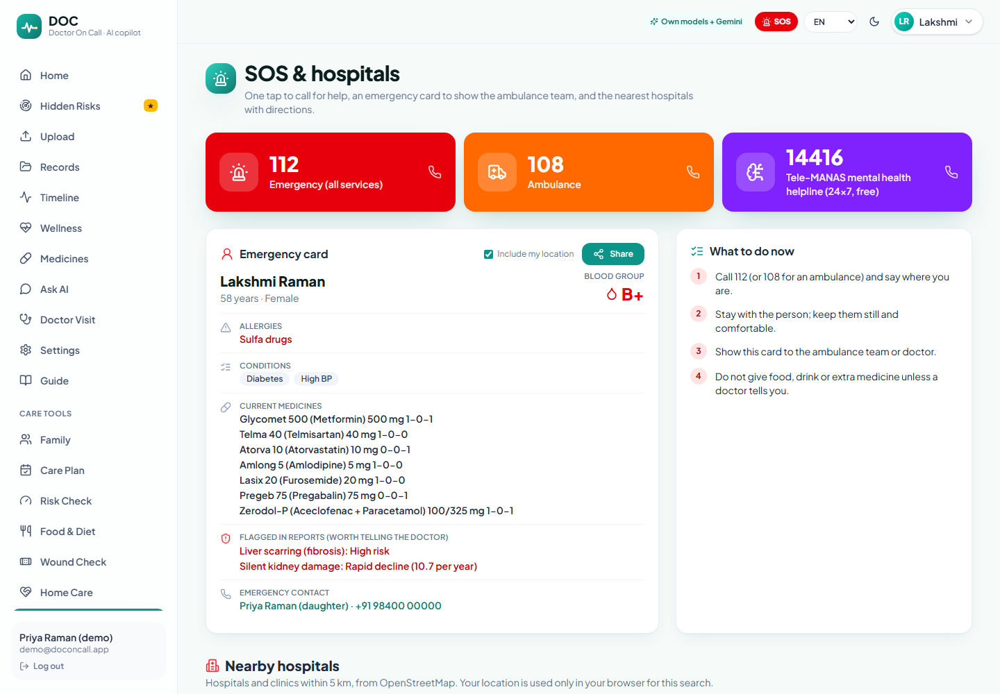 | 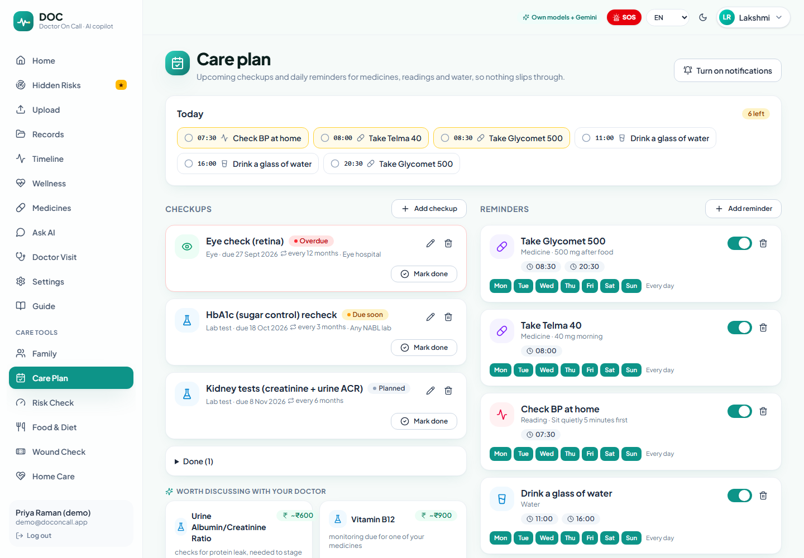 |

<p align="center">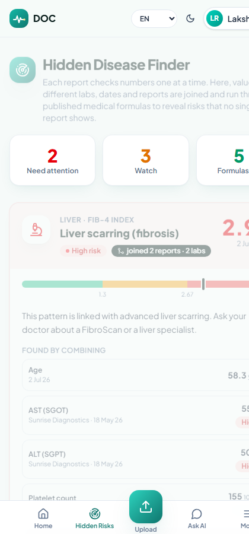 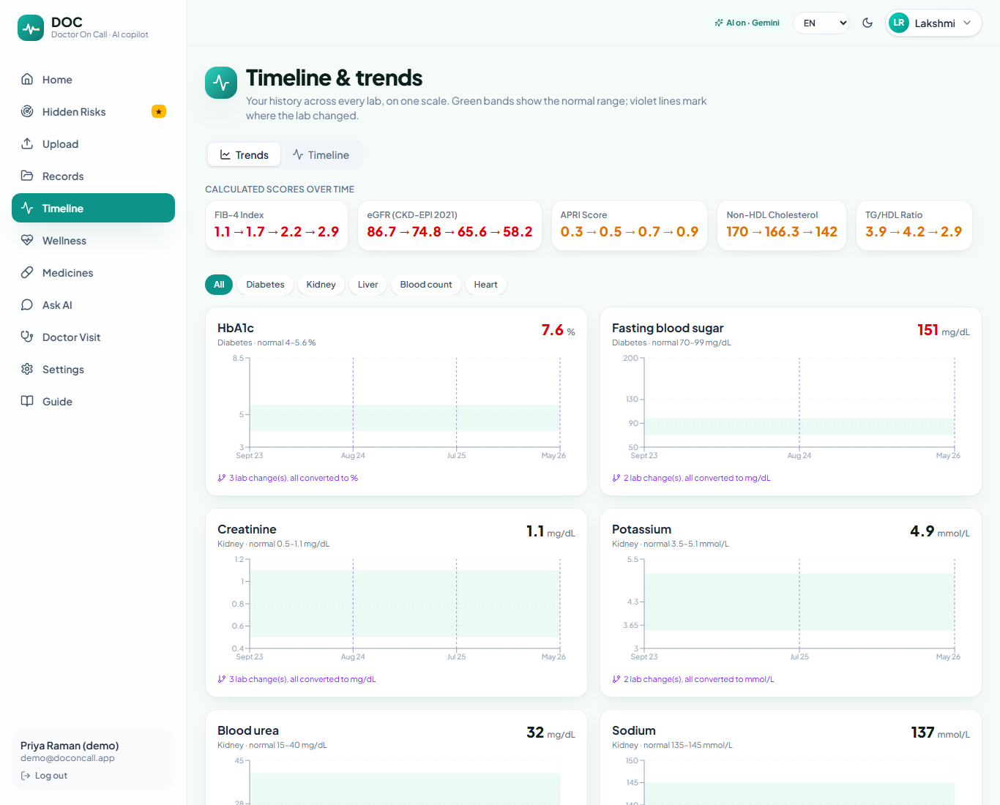</p>

---

## 1. The problem
Indian families managing chronic illness (diabetes, BP, thyroid, kidney disease) carry **folders of disconnected paper**:
- Each lab report checks **one number at a time**. "Normal" on every page can hide a dangerous **combination**.
- Different labs print the same test differently (`2.5 lakhs/cumm`, `250 ×10³/µL`, `250000 /cumm`), so trends across years are invisible.
- Prescriptions from several doctors are never checked together against the kidneys, against each other, or against home BP and sugar readings.
- Grown-up children help ageing parents by sharing passwords and WhatsApp photos, with no control over who sees what.

Existing apps mostly **store** records or **summarise one report at a time**. They don't **reason across** them.

## 2. The solution in one picture
```
 Report A (Sunrise Diagnostics, May)        Report B (CityCare Pathology, July)
   AST 55 U/L   ALT 50 U/L                    Platelets 1.55 lakhs/cumm ✓ "normal"
              \                                  /
               \______ joined by DOC (45 days apart, within the 120-day window) ___/
                                   │
          FIB-4 = (Age 58.3 × AST 55) ÷ (Platelets 155 × √ALT 50) = 2.93  🔴 high
          was 1.15 in 2023 → rising every year → "Ask your doctor about a FibroScan"
          + home BP 148/91 since starting a painkiller → "Could Zerodol-P be raising your BP?"
          + son (approved: summary + records) sees the same trend → books the visit
```

## 3. Core innovation: Hidden Disease Finder
| Formula | Hidden condition | Inputs (often from **different** reports) | Source |
|---|---|---|---|
| **FIB-4** | Liver scarring | Age, AST, ALT (LFT) + platelets (CBC) | Sterling 2006, *Hepatology*; age ≥65 cut-off McPherson 2017 |
| **APRI** | Liver scarring | AST + platelets | Wai 2003, *Hepatology* |
| **eGFR CKD-EPI 2021** + decline slope | Silent kidney damage (rapid decline > 5/yr, KDIGO) | Creatinine, age, sex | Inker 2021, *NEJM* (race-free) |
| **Mentzer index** | Thalassaemia trait vs iron deficiency | MCV, RBC | Mentzer 1973, *Lancet* |
| **TyG index** | Insulin resistance before diabetes | Triglycerides + fasting glucose | Simental-Mendía 2008 |
| **TG/HDL** | Insulin resistance / atherogenic lipids | TG, HDL | McLaughlin 2003, *Ann Intern Med* |
| **Non-HDL cholesterol** | Heart & artery risk | Total cholesterol, HDL | NCEP ATP III; Lipid Association of India |
| **Corrected calcium** | Calcium problem masked by low albumin | Calcium + albumin | Payne 1973, *BMJ* |

Values are normalised to canonical units and LOINC codes; the engine pairs the nearest value of every other input within a validated window, computes the score in unit-tested code, maps it to 🟢/🟡/🔴 with published cut-offs, recomputes the history and fits a trend. Every result carries full provenance (lab, date, printed line).

## 4. Features
| Area | Features |
|---|---|
| 🔐 Sign-in | **Firebase**: Continue with Google, email + password, email verification, password reset. One-click demo. Backend verifies every token; all authorisation in backend code. |
| 📤 Records pipeline | PDF/photo/camera (jpg/png/webp/pdf ≤15 MB, first 4 PDF pages). **Own reader**: PDF text layer → or **PyMuPDF page images + Tesseract OCR (eng+tam)** → dictionary NER → LOINC normaliser → unit converter → ISO dates. Per-item confidence + source line; <0.75 → "check this" list; brand → generic. AI boost only when our reading is weak. Corrections after saving re-normalise and re-flag in code (`user_verified`). |
| 🏥 Discharge summaries & diagnoses | Discharge summaries detected automatically (admission/discharge dates). Diagnoses read from *Final diagnosis / Impression / Dx* and Indian shorthand *K/C/O DM, HTN*, coded to **ICD-10 + SNOMED CT** (42-condition dictionary), each with a plain-language meaning; unknown items go to review. Confirmed diagnoses switch on care-gap rules, appear in the timeline, chat and FHIR `Condition` resources. Handwritten / Tamil-English prescriptions via the AI boost with low-confidence review. |
| 🗂️ Records & trends | Flags normal/low/high/**critical_low/critical_high** (code), plain-language summary (English + **Tamil** templates), trends with `change_percent`, direction and a neutral sentence, timeline, FHIR R4 export per record or combined |
| 🎯 Hidden Disease Finder ★ | 8 formulas, gauges, plugged-in equations, source chips, trends, next step, citations |
| 🧪 Risk check (ML) | XGBoost diabetes (Pima) + heart (Cleveland) screening, **TreeSHAP top 3 factors**, imputed features listed, bands, model cards, "screening estimate, not a diagnosis" |
| ❤️ Wellness & devices | BP, sugar (fasting/post-meal), weight, heart rate, SpO₂, steps, sleep, water, calories; CSV import; simulated BP monitor / glucometer / band / scale (`source=device_demo`) |
| 👨‍👩‍👧 Family | Managed profiles (up to 10) **plus consent-based sharing between accounts**: request → owner approves chosen permissions (records, timeline, summary, vitals, medicines, chat) → revoke anytime; every access in the owner's audit log; family chat uses only permitted data |
| 💊 Medicines | 45 Indian brands → 30 generics, savings, kidney dose checks, cascades, monitoring; **safety KB**: 57 food notes, 18 interactions, duplicate salts, same-type warnings, lab cautions |
| 📅 Care plan | Checkups (overdue / due soon, auto-repeat, suggestions from care gaps), reminders (medicine times from "1-0-1", readings, water) with today's checklist and browser notifications |
| 🍛 Food & diet | 65 Indian foods (IFCT 2017 / USDA), "2 idli, sambar and coffee" → nutrition (own parser), photo scan (AI boost), 7-day chart, rule-based tips that cite your own values |
| 🩹 Wound check | Own colour-analysis model (redness / slough / dark tissue / area) + safety questionnaire rules (diabetic foot, bites, fever + spreading redness → emergency) + healing comparison |
| 🏠 Home care | 15 common problems with safe self-care, what to avoid and red flags (WHO/NHS/CDC/ICMR sources) |
| 🚨 SOS | SOS button on every screen, tap-to-call 112 / 108 / Tele-MANAS 14416, emergency card (blood group, allergies, medicines, contact), share with location, **nearby hospitals from OpenStreetMap** |
| 💬 Ask AI | RAG over the person's own records (own embeddings; pgvector), citations, verifier pass, urgent-word rules, voice input + read-aloud (en-IN / hi-IN / ta-IN), scope "me" or an approved family member |
| 🩺 Doctor visit | One-page summary, PDF (+ **Tamil family page**), expiring share links |
| 🆔 ABHA | Link ABHA number (12-3456-7890-1234) / address (name@abdm), mock import, ABHA in FHIR Patient |
| 🌐 Site & app | Public site, onboarding tour, guide, 27 pages, mobile bottom bar, installable PWA, dark mode |

## 5. Mapping to the challenge brief
| Brief says… | DOC |
|---|---|
| *understand* | Plain-language summaries (EN/HI/TA), explain-simply + teach-back, grounded chat, voice |
| *organize* | Own OCR + parser + confirm, LOINC/UCUM normalisation, timeline, FHIR R4, ABHA |
| *manage* | Care plan, reminders, medicine safety KB, diet tips, wound check, SOS, family care with consent |
| *medical records, prescriptions, diagnostic reports* | Upload → structured, confirmed, corrected, linked records |
| *wellness data* | Vitals, devices, meals, risk screening |
| *actionable insights* | Every alert ends with the question to ask the doctor; urgent rules force "see a doctor now" |

## 6. Architecture
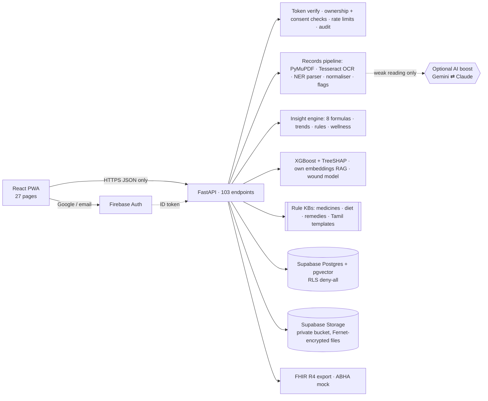
The browser never talks to Supabase; only the API holds the service-role key. Details: [docs/ARCHITECTURE.md](docs/ARCHITECTURE.md) · [API reference](docs/API.md) · [schema.sql](backend/schema.sql)

**Stack:**
- Frontend: React 18 · TypeScript · Vite · Tailwind CSS v4 · Recharts · Firebase JS SDK · vite-plugin-pwa · Web Speech API
- Backend: FastAPI · SQLAlchemy 2 · Pydantic · PyJWT (Firebase token verification) · cryptography · httpx · PyMuPDF · pytesseract · fpdf2 + HarfBuzz (Tamil) · NumPy · XGBoost
- Data: Supabase Postgres + pgvector + Storage (SQLite + local encrypted files for development)
- Optional AI boost: Google Gen AI SDK (Gemini Flash) · Anthropic SDK (Claude Opus 5.5)
- Tooling: pytest · ruff · fhir.resources · GitHub Actions · Docker · Render

## 7. AI design: our own models first
| Task | Done by | Why |
|---|---|---|
| Reading PDFs and photos | **Own**: PDF text / Tesseract OCR + dictionary NER parser. **Boost**: Gemini/Claude vision only when our reading is weak | Works offline and free; boost for messy handwriting |
| Lab flags incl. critical | **Code** from value + reference range + catalogue critical limits | Never decided by an LLM |
| Formulas, trends, rules, wellness targets | **Unit-tested code** | Reproducible, no hallucinated numbers |
| Diabetes / heart screening | **Own XGBoost** models + exact TreeSHAP | Explainable, measurable (CV AUC) |
| Chat retrieval | **Own 1024-d hashed embeddings** + pgvector cosine search | No external embedding API |
| Medicine safety, diet tips, remedies | **Deterministic knowledge bases** with sources | Auditable |
| Tamil/Hindi sentences | **Curated templates** (AI only for free-form chat) | Predictable wording |
| Wound photo | **Own colour analysis** + safety questionnaire rules | Conservative, explainable |
| Free-form answers | AI (when enabled) from ID-tagged records + retrieved chunks, then a verifier pass; offline answers from rules + retrieval | Grounding + hallucination control |

## 8. Evaluation (reproducible)
| Check | Result | Command |
|---|---|---|
| Automated tests (formulas, units, parser, flags incl. critical, **FHIR R4 validation**, **family consent: unapproved can't read, approved is filtered, revoke blocks instantly, requester can't self-approve**, records corrections, signed URLs, vitals, care plan, risk, RAG, urgent rules, meals, wound, test-kit answer key) | **94 / 94** | `pytest -q` |
| Formulas vs hand calculations | **9 / 9** | `python scripts/evaluate.py` |
| Own reader, 100 synthetic Indian-style PDFs (782 values, 4 unit systems) | names **100%**, values **100%**, dates **100%** | `python scripts/evaluate.py 100` |
| AI boost (Gemini) on 6 synthetic phone photos (37 values) | recall **100%**, **0 hallucinated tests** | `python scripts/eval_ai.py 6` |
| XGBoost diabetes (Pima, n=768) | 5-fold CV AUC **0.834 ± 0.039**, Brier 0.157, calibration slope 1.00 | `python -I scripts/train_risk.py ...` |
| XGBoost heart (Cleveland, n=303) | 5-fold CV AUC **0.913 ± 0.032**, Brier 0.122, calibration slope 1.00 | same |

Honest limits are in [docs/EVALUATION.md](docs/EVALUATION.md).

## 9. Security, privacy & safety
- **Auth:** Firebase ID tokens verified on the server (signature, audience, issuer, expiry); short session JWTs; rate-limited sign-in; local email/password only in development mode.
- **Persistence:** production runs on PostgreSQL (Render free Postgres via the Blueprint, or Supabase). Users, records and even the encrypted original files (bytea) survive restarts; the file-encryption key is kept in the database when not set as an env var.
- **Data access:** the frontend talks only to the API. The API uses the Supabase service role (env var only); every table has row-level security ON with no policies (deny-all for anon/authenticated). Ownership and family-consent checks run on **every request**.
- **Files:** Fernet-encrypted on the server, then stored at `{uid}/{uuid}-{filename}` in a private bucket; downloads via 5-minute signed URLs to our API.
- **Family consent:** adding someone never grants access; only the owner approves, changes permissions or revokes; revoked/denied/pending → 403; responses filtered by permission; every access audited and shown to the owner.
- **Operations:** CORS allow-list (`ALLOWED_ORIGINS`), file type + magic-byte checks, rate limits on AI endpoints, uniform `{error, detail}` errors, structured logs without PHI, `/health`, timeouts + retries with friendly errors, `.env.example` (no secrets in code).
- **Clinical safety:** never diagnoses or prescribes; "may / can indicate / worth discussing"; disclaimer on every AI response; urgent code rules (critical labs, BP ≥180/120, sugar <54 or >400, SpO₂ <90, chest pain/stroke/self-harm words) force a "see a doctor now / call 112" banner; demo data flagged `is_demo`.

More: [docs/SAFETY.md](docs/SAFETY.md)

## 10. Run it
```bash
# Windows, one command (installs, builds, opens the browser)
.\start.ps1
```
**Manual:**
```bash
cd backend && python -m venv .venv && .venv/Scripts/activate && pip install -r requirements.txt
cp .env.example .env        # everything optional for local use
cd ../frontend && npm install && npm run build
cd ../backend && uvicorn app.main:app --port 8000      # open http://127.0.0.1:8000
```
Without any keys DOC runs fully offline: SQLite, local encrypted files, local sign-in, own models. Add Firebase, Supabase and (optionally) Gemini keys from [.env.example](backend/.env.example) for production. Tesseract OCR is installed in the Docker image; on Windows install it from UB-Mannheim to read photos locally.

**Deploy:** Docker (`docker build -t doc .`) or Render Blueprint ([render.yaml](render.yaml)). Set `DOC_ENCRYPTION_KEY` to a fixed Fernet key so stored files stay readable across restarts.

**Demo:** `/demo` (no sign-up). The demo family has care plans, a linked daughter-in-law (Sujitha, HbA1c 5.8 → 6.0 → 6.2) shared with consent, a pre-approved father, and a pending request to try approving. Everything is `is_demo`.

## 11. Project structure
```
backend/app/services/  engine ★ · formulas · flags · fhir · family · rag · embed · risk · ocr · extraction · normalizer · units
                       medsafety · nutrition · wound · care · safety · templates · storage · firebase_auth · ai · assistant · summary
backend/app/routers/   auth · records_api · reports · profiles · insights · wellness · family · care · features · doctor · assistant · account
backend/data/          lab_tests · formulas · panels · medicines · med_safety · nutrition_in.csv · remedies · tamil · wellness · models/ (XGBoost)
backend/tests/         94 tests          backend/scripts/  verify · evaluate · eval_ai · train_risk · make_schema · make_test_kit
frontend/src/pages/    Dashboard · Upload · Review · Records · Timeline · Risks · Screening · Wellness · Medicines · Meals · WoundCheck
                       Remedies · CarePlan · Family · Chat · Doctor · Emergency · Settings · Guide · Landing · About · Contact · Legal
datasets/              demo_family · demo_extras · abha_mock · test_kit/ (+ANSWER_KEY) · public/ (Pima, Cleveland + README)
docs/                  API · ARCHITECTURE · EVALUATION · SAFETY · JUDGES_QA · screenshots/
```

## 12. How DOC is different
| Capability | Generic AI chat (upload a PDF) | Record-storage apps | **DOC** |
|---|---|---|---|
| Joins values across reports, labs and years | ✗ | ✗ | **✓ time-window pairing** |
| Works without any external AI | ✗ | ✓ (no insight) | **✓ own OCR, parser, ML, RAG** |
| Validated formulas + flags computed in code | ✗ (LLM arithmetic) | ✗ | **✓ unit-tested** |
| Explainable ML screening | ✗ | ✗ | **✓ XGBoost + SHAP** |
| Consent-based family sharing | ✗ | password sharing | **✓ per-permission, revocable, audited** |
| FHIR R4 + ABHA | ✗ | rarely | **✓** |
| Tamil/Hindi, Indian foods & brands | partial | partial | **✓** |

## 13. Limitations & roadmap
**What is mocked / simulated:** ABHA linking and import (format check + demo record), connected devices (simulated readings), demo family data. **Limitations:** cut-offs and ML training data come from non-Indian cohorts (Pima women; 1988 Cleveland clinic); OCR quality depends on the photo, which is why the confirm/review step exists; nutrition values are approximate; not a certified medical device (CDSCO SaMD pathway needed).

**Roadmap:** real ABDM sandbox (HIP/HIU consent flows) · Bluetooth meters · WhatsApp reminders · Indian-cohort recalibration of risk models · clinician-labelled evaluation set.

## 14. Disclaimer
DOC is a **decision-support and education tool**. It **does not diagnose, treat or replace a doctor**. All demo data is synthetic (fictional people and labs). In an emergency call **112 / 108**.

<div align="center"><sub>MIT License · Built for the Altrix Labs Hackathon</sub></div>
