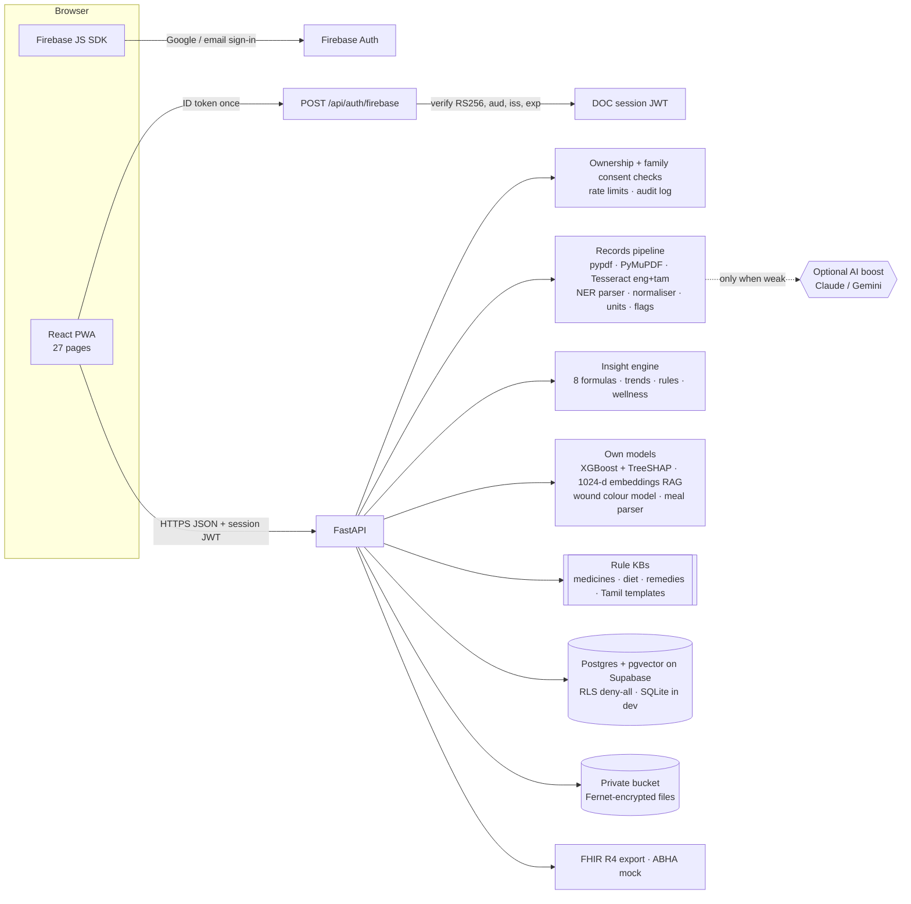
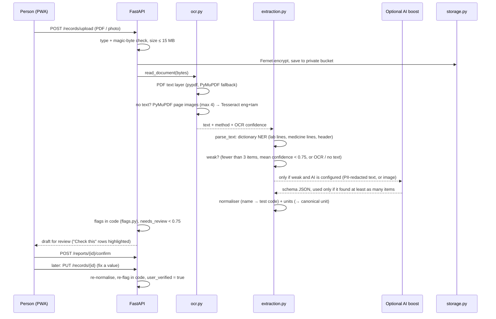

# DOC architecture (v2)

DOC is one FastAPI service plus a React PWA. The API does all the work with **its own models and rules**.
An external AI (Gemini or Claude) is an **optional boost**, used only when our own reading is weak or for free-form chat.

## 1. Big picture

The browser never talks to Supabase. Only the API holds the service-role key.

## 2. Records pipeline (upload → confirm → correct)

| Step | File | What it does |
|---|---|---|
| Read text | `services/ocr.py` | pypdf text layer first. If a PDF has no text, PyMuPDF renders up to **4 pages** at 200 dpi and **Tesseract** reads them in **English + Tamil** (`eng+tam` when installed). Photos go straight to Tesseract. Returns text, method and mean word confidence. |
| Parse | `services/extraction.py` `parse_text` | Dictionary-based NER: finds lab lines (name, value, unit, range), medicine lines (brand, dose, frequency) and header fields (lab, doctor, date). Every item keeps its source line and a confidence. OCR items get lower confidence. |
| Optional boost | `services/extraction.py` `extract`, `services/ai.py` | The AI is called **only when our reading is `weak`**: fewer than 3 items, mean confidence < 0.75, or the text came from OCR / nothing was read. Text is PII-redacted first. The AI answer is used only if it finds at least as many items as we did. |
| Normalise | `services/normalizer.py`, `services/units.py` | Test name → canonical code (exact alias → contained alias → fuzzy, each with a confidence). Units → one canonical unit (lakhs/cumm, ×10³/µL, µmol/L, mmol/L …), with magnitude checks when a unit is missing. |
| Flag | `services/flags.py` | normal / low / high / critical_low / critical_high from the number, the range and catalogue critical limits. `needs_review` below 0.75. |
| Review and confirm | `routers/reports.py` | The person checks the draft and confirms. Only confirmed values are used downstream. |
| Correct later | `routers/records_api.py` `PUT /records/{id}` | Fix a value, unit, code or range. It is re-normalised and re-flagged in code, marked `user_verified`, and audited. |

## 3. Our own models
| Model | File | How it works |
|---|---|---|
| OCR | `services/ocr.py` | Tesseract (open source) inside the Docker image. No data leaves the server. |
| Report parser (NER) | `services/extraction.py` | Dictionary + pattern rules over the test catalogue and medicine list. |
| Risk screening | `services/risk.py` | Two **XGBoost** models (diabetes on Pima, heart on Cleveland), trained by `scripts/train_risk.py`, stored in `data/models/`. Exact **TreeSHAP** contributions (`pred_contribs`) give the top 3 factors from the person's own values. Missing values use XGBoost's missing branch, or the training median for features that were never missing in training. Needs at least 2 real values. |
| Embeddings | `services/embed.py` | Our own **1024-d** feature-hashing embedding: words, medical synonyms mapped to test codes, word bigrams and character 3-grams, signed blake2b hashing, log term frequency, L2-normalised. Deterministic, no external model. |
| Retrieval (RAG) | `services/rag.py` | A person's facts become short chunks with citation ids and a permission `section`. On Postgres, **pgvector** + the `match_chunks()` SQL function (cosine, HNSW index). On SQLite, the same cosine ranking in Python. Family chat only retrieves allowed sections. |
| Wound photo | `services/wound.py` | Classical colour analysis (HSV): redness, yellow, dark, rough wound area, edge redness. Code rules + questionnaire decide urgency. Can compare two photos of the same wound. |
| Meal parser | `services/nutrition.py` | Parses text like "2 idli, sambar and coffee" into foods and portions, using a 65-food Indian table (`data/nutrition_in.csv`). Diet tips are rules that cite the person's own values. |
| Insight engine | `services/engine.py`, `services/formulas.py`, `services/wellness.py` | 8 clinical formulas with time-window pairing across reports, trends, drifts, medicine rules, wellness links. |

**Optional AI boost** (`services/ai.py`): Claude and Gemini behind one interface, with strict JSON schemas, per-call timeout, a total time budget and fallback between engines. Used for weak document readings, meal photo scans, voice transcription fallback and free-form chat (with a verifier pass). If no engine is configured or all fail, the app runs fully offline.

## 4. Other components
| Component | File | Notes |
|---|---|---|
| Chat | `services/assistant.py`, `routers/assistant.py` | ID-tagged context + retrieved chunks → answer with citations → verifier pass. Offline: rules + our own retrieval. Urgent-word rules always run. |
| Urgent rules | `services/safety.py` | Critical labs, home BP, sugar, SpO₂, urgent words (EN/TA/HI). |
| Templates | `services/templates.py`, `data/tamil.json` | Summaries, trends, risk sentences and the disclaimer in English, Tamil and Hindi. |
| Medicine safety | `services/medsafety.py`, `data/med_safety.json` | Deterministic KB. |
| Care plan | `services/care.py`, `routers/care.py` | Checkups (auto-repeat, suggestions from care gaps), reminders, devices (simulated), ABHA (mock), SOS card. |
| FHIR | `services/fhir.py` | R4 Bundle (collection): Patient (+ABHA), DocumentReference, DiagnosticReport, Observation (LOINC, UCUM, referenceRange, interpretation), MedicationRequest, Condition, vital-sign Observations. Validated in tests with `fhir.resources` R4B models. |
| Family consent | `services/family.py`, `routers/family.py` | `require_access()` is the only way family data is read. `scoped_view()` gives a permission-filtered copy for analysis and chat. |
| Storage | `services/storage.py` | Fernet-encrypt → private Supabase bucket (`sb:` refs) or local `instance/uploads`. Signed 5-minute URLs via `/api/files/{token}`. |
| Sign-in | `services/firebase_auth.py`, `routers/auth.py`, `security.py` | Firebase ID token check without a service-account key; session JWT; rate limits; audit log. |
| Doctor summary | `services/summary.py`, `routers/doctor.py` | One-page JSON + PDF (fpdf2), optional Tamil family page, expiring share links. |

## 5. Database
- **Development:** SQLite in `backend/instance/`.
- **Production:** Supabase **Postgres + pgvector** via `DATABASE_URL` (psycopg 3, small pool for the free plan).
- Same SQLAlchemy models for both. The `Embedding` type is `vector(1024)` on Postgres and a JSON list on SQLite.
- `init_db()` in `database.py`: creates the `vector` extension, creates tables, runs a **tiny forward-only migration** (adds new nullable columns to older tables), creates `match_chunks()`, enables **row-level security on every table with no policies** (deny-all), and adds an HNSW index on chunk embeddings.
- `backend/schema.sql` is the same schema as plain SQL (generated by `scripts/make_schema.py`).

**Tables:** users, profiles, reports, lab_results, medications, symptoms, vital_readings, share_links, audit_logs, contact_messages, family_links, checkups, reminders, chunks, devices, meal_logs, wound_scans.
Lab values are stored both as printed (`value_raw`, `unit_raw`, `source_text`) and canonical (`value`, `unit`, `test_code`), so provenance is never lost.

## 6. Curated data (`backend/data/`)
| File | Content |
|---|---|
| `lab_tests.json` | 32 tests: aliases, unit factors, sex-specific ranges, critical limits (8 tests), plausibility bounds, plain-language text |
| `formulas.json` | 8 formulas: inputs, pairing window, bands, next step, citation |
| `medicines.json` | 45 brands → 30 generics: class, side effects, kidney rules, monitoring |
| `med_safety.json` | 57 food notes, 18 interactions, 13 lab cautions, duplicate and same-type notes |
| `nutrition_in.csv` | 65 Indian foods (IFCT 2017 / USDA, approximate) |
| `remedies.json` | 15 home-care topics with red flags |
| `tamil.json` | Templates in English, Tamil and Hindi |
| `panels.json`, `rules.json`, `wellness.json` | Lab panels, care-gap and cascade rules, home reading thresholds |
| `models/` | XGBoost boosters + model cards (`*_meta.json`) |

## 7. Frontend
React 18 + TypeScript + Vite + Tailwind v4 + Recharts, installable PWA (vite-plugin-pwa).

**Sign-in flow** (`frontend/src/lib/firebase.ts`):
1. The app calls `GET /api/auth/config`. If the mode is `firebase`, it loads the Firebase SDK.
2. The person uses **Continue with Google** (popup) or email + password.
3. The app gets a Firebase ID token and sends it once to `POST /api/auth/firebase`.
4. The API verifies it and returns a **DOC session JWT**, used for every later call.
5. In local mode (no Firebase keys), `/auth/login` and `/auth/register` are used instead.

**Pages** (routes in `frontend/src/App.tsx`):

| Public | App (`/app/...`) |
|---|---|
| `/` Landing · `/login` · `/register` · `/demo` · `/about` · `/contact` · `/legal` · `/share/:token` (doctor share link) · 404 | Home (dashboard) · Upload · Records · Records/:id (review) · Timeline · Hidden Risks · Medicines · Ask AI · Doctor Visit · Settings · Guide · Wellness · Family · Care Plan · Risk Check (`screening`) · SOS (`emergency`) · Food & Diet (`meals`) · Wound Check (`wound`) · Home Care (`remedies`) |

Layout: sidebar on desktop, bottom bar on mobile, red SOS button in the top bar on every app screen, language switch (English / हिन्दी / தமிழ்), dark mode. The report viewer (`components/ReportDrawer.tsx`) shows the original file, a simple summary (English or Tamil), FHIR download and **Fix a value**.

## 8. Deployment
- One process serves the API and the built SPA (`frontend/dist`).
- **Docker:** builds the SPA, installs Tesseract (`eng` + `tam`), runs uvicorn on `$PORT`.
- **Render:** `render.yaml` blueprint.
- **CI:** GitHub Actions runs ruff, pytest, the offline evaluation and the frontend build.
- `GET /health` reports version, auth mode, database, storage backend and whether OCR is available.
