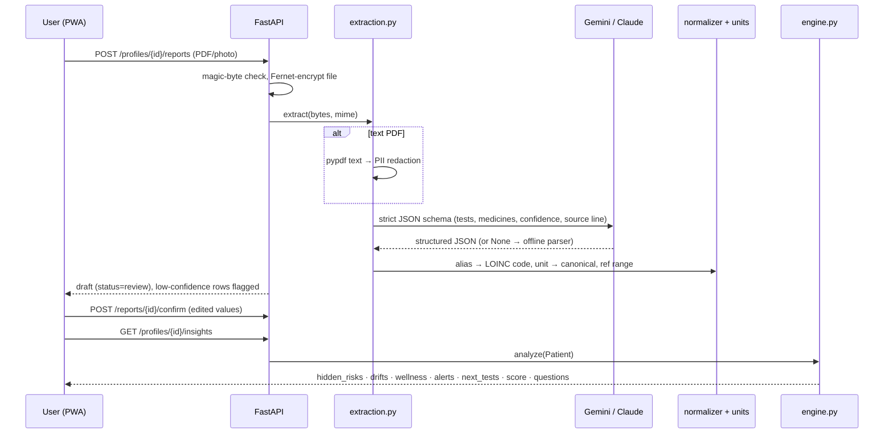

# DOC architecture

## Request flow: upload → confirm → insight

## Modules
| Module | Responsibility |
|---|---|
| `services/formulas.py` | Pure functions for the 8 clinical formulas + band classification (`formulas.json`). No I/O, fully unit-tested. |
| `services/engine.py` | **Hidden Disease Finder.** Builds formula time series by anchoring on one input and pairing the nearest other inputs inside each formula's validated window (prefers same report). Also: least-squares trends, personal-baseline drifts, alerts (critical values, kidney-dose rules, triple whammy, prescribing cascades, side-effect timing, monitoring, iron-without-improvement, care gaps, repeat tests), Next Best Test ranking, snapshot score, doctor questions. |
| `services/wellness.py` | Home-reading analysis (BP, glucose, weight/BMI, HR, SpO₂, steps, sleep): 30-day averages, guideline thresholds, and cross-links such as *BP rise after NSAID start*. |
| `services/extraction.py` | Document → draft. AI path (schema-constrained JSON) or offline rule parser; date/number/range parsing; medicine brand matching. |
| `services/normalizer.py`, `units.py` | Test-name normalisation (exact → contained alias → fuzzy, each with confidence); unit harmonisation (lakhs/cumm, ×10³/µL, µmol/L, mmol/L, mmol/mol, …) with magnitude-based inference when a unit is missing. |
| `services/ai.py` | Provider abstraction: Claude and Gemini, ordered by `AI_PROVIDER`; Gemini model fallback chain; per-request timeout and total time budget; refusal/503/429 handling; returns `None` so callers can fall back to offline mode. |
| `services/assistant.py` | Grounded chat: builds an ID-tagged context (`[R12]` result, `[M3]` medicine, `[S1]` symptom, `[V:bp]` wellness, `[I:fib4]` insight, `[A:…]` alert) → answer with citations → **second-pass verifier** → corrected/flagged. Simple-language explanations with teach-back quiz. Keyword fallback offline. |
| `services/summary.py` | Doctor-visit summary (JSON + PDF via fpdf2). |
| `services/pii.py` | Regex redaction of names, phones, emails, Aadhaar-like numbers, UHID/MRN, addresses. |
| `security.py` | bcrypt, JWT, TOTP (pyotp) + QR (SVG), hashed backup codes, Fernet field/file encryption, rate limiter, audit helper. |
| `routers/*` | auth, profiles (+symptoms), reports (+results, trends, timeline), insights (+dashboard, medicines), wellness, doctor (+share links, public share), assistant (chat, explain), account (meta, samples, contact, audit, export, delete, demo reset). |

## Data model
`User` 1–N `Profile` 1–N {`Report` 1–N `LabResult`, `Medication`, `Symptom`, `VitalReading`, `ShareLink`}; `AuditLog`, `ContactMessage`.
Lab values are stored **both** as printed (`value_raw`, `unit_raw`, `source_text`) and canonical (`value`, `unit`, `test_code`), so provenance is never lost.

## Curated datasets (`backend/data/`)
| File | Content |
|---|---|
| `lab_tests.json` | 32 tests, 30 LOINC-mapped; aliases, unit factors, sex-specific ranges, critical values, plausibility bounds, plain-language text |
| `formulas.json` | 8 formulas: inputs, pairing window, bands, notes, next step, why-hidden, citation |
| `panels.json` | 12 Indian lab panels with illustrative ₹ prices |
| `medicines.json` | 45 brands → 30 generics: class, side effects, eGFR rules, monitoring rules, illustrative prices |
| `rules.json` | Prescribing cascades and care-gap rules with citations; repeat-test windows |
| `wellness.json` | 7 reading types with home thresholds and citations |

## Frontend
React 18 + TypeScript + Vite + Tailwind v4.
- **Public site:** `PublicLayout`, which includes the header/footer, the `CursorFX` canvas trail, `WaveBackground`, the `OnboardingTour` and scroll-reveal.
- **App:** `AppLayout`, with a sidebar on desktop and a bottom tab bar on mobile.
- **Data:** a small `useFetch` hook; context for user, profiles, language and theme.
- **Modals:** rendered through a portal.
- **PWA:** vite-plugin-pwa (Workbox).
- **Charts:** Recharts.

## Deployment
One process serves both API and the built SPA (`frontend/dist`).
- **Docker:** the image builds the SPA, then runs uvicorn on `$PORT`.
- **Render:** `render.yaml` blueprint.
- **CI:** GitHub Actions runs ruff, pytest, the offline evaluation and the frontend type-check/build.
